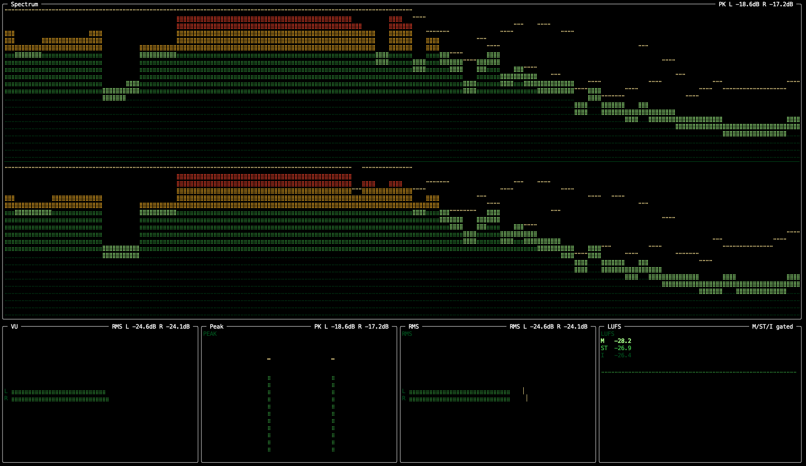

# phosphor

A real-time terminal audio analyzer. Captures your Mac's system audio and renders a glowing spectrum analyzer alongside VU, Peak, RMS, and LUFS meters in a vintage hi-fi style.



## Requirements

- macOS 12+, Intel or Apple Silicon
- Python 3.9+
- [BlackHole 2ch](https://existential.audio/blackhole/) (free virtual audio driver)

## Install

```bash
pipx install "git+https://github.com/weiyizheng/phosphor.git"
```

Install from local clone:

```bash
git clone https://github.com/weiyizheng/phosphor
cd phosphor
pipx install .
```

For development:

```bash
git clone https://github.com/weiyizheng/phosphor
cd phosphor
pip install -e ".[dev]"
```

`pipx install phosphor` will work only after the package is published to PyPI.

## Setup

phosphor captures audio by reading from BlackHole, a virtual audio device that mirrors your system output.

### Quick setup (recommended)

**1. Install BlackHole 2ch**

```bash
brew install blackhole-2ch
```

**2. Create a Multi-Output Device in Audio MIDI Setup**

This avoids losing speaker output while letting phosphor capture system audio.

1. Open **Audio MIDI Setup** (Applications -> Utilities)
2. Click **+** -> **Create Multi-Output Device**
3. Check both:
   - your physical output (speakers/headphones)
   - **BlackHole 2ch**
4. Set the physical output as the **Master Device**
5. Enable **Drift Correction** on **BlackHole 2ch**
6. Rename it (for example `phosphor Multi-Output`)

**3. Match sample rates**

For both the physical device and BlackHole:

1. Select each device in Audio MIDI Setup
2. Set **Format** to the same value, preferably **48,000 Hz**

Mismatched rates often cause unstable meters and distorted levels.

**4. Set macOS output**

System Settings -> Sound -> Output -> select your `phosphor Multi-Output` device.

**5. Verify capture device name**

```bash
phosphor --list-devices
```

Find the exact `BlackHole 2ch` device string and use it if needed:

```bash
phosphor --device "BlackHole 2ch"
```

**6. Run the built-in setup and start**

```bash
phosphor --setup
phosphor
```

### Troubleshooting

- No app audio while phosphor is running:
  - Recheck macOS output is the Multi-Output device, not BlackHole alone.
- Meters pinned/saturated:
  - Confirm sample rates are matched and app/device volume is not clipping.
- Wrong capture source:
  - Run `phosphor --list-devices` and set `--device` explicitly.
- Silence in phosphor:
  - In Audio MIDI Setup, verify BlackHole is included in Multi-Output and enabled.

## Usage

```bash
# Launch with defaults
phosphor

# Change phosphor color
phosphor --color amber       # green | amber | blue | white | btop | hifi

# Change frequency band count
phosphor --bands 128         # 32 | 64 | 128 | auto

# Change layout
phosphor --layout dashboard  # classic | dashboard

# View a single meter fullscreen
phosphor --mode spectrum
phosphor --mode vu
phosphor --mode peak
phosphor --mode rms
phosphor --mode lufs

# Limit framerate (saves CPU)
phosphor --fps 30

# Sum stereo to mono
phosphor --mono

# Use a specific capture device
phosphor --device "BlackHole 2ch"

# List available audio input devices
phosphor --list-devices

# First-run setup guide
phosphor --setup
```

Press `q` to quit.

## Layouts

**Classic** (default) — spectrum on top, meters along the bottom:

```
┌─────────────────────────────────────────┐
│                                         │
│             SPECTRUM                    │
│                                         │
├──────────┬──────────┬──────────┬────────┤
│    VU    │   PEAK   │   RMS    │  LUFS  │
└──────────┴──────────┴──────────┴────────┘
```

**Dashboard** — spectrum left, meters stacked right:

```
┌─────────────────────┬──────────────────┐
│                     │       VU         │
│                     ├──────────────────┤
│      SPECTRUM       │      PEAK        │
│                     ├──────────────────┤
│                     │       RMS        │
│                     ├──────────────────┤
│                     │      LUFS        │
└─────────────────────┴──────────────────┘
```

## Phosphor Colors

| Preset  | Look                                      |
|---------|-------------------------------------------|
| `green` | Classic Futaba/Noritake phosphor style |
| `amber` | Warm vintage hi-fi receiver               |
| `blue`  | Modern Sony/Pioneer equipment             |
| `white` | High-brightness neutral                   |
| `btop`  | High-contrast neon gradient               |
| `hifi`  | Refined audiophile-inspired palette (default) |

## Meters

| Meter    | What it shows | Default style |
|----------|---------------|---------------|
| Spectrum | Frequency content of the audio, log scale | Bars + glow + peak hold |
| VU       | Average loudness with ballistic decay | Segmented bar |
| Peak     | Instantaneous highest sample (clipping risk) | Vertical bar pair |
| RMS      | Perceived loudness (~300ms average) | Dual bar with peak overlay |
| LUFS     | Broadcast/streaming loudness standard | Numeric + scrolling history graph |

Each meter style is configurable. See `~/.config/phosphor/config.toml` for options.

## Configuration

On first run, phosphor creates a fully-commented config file at:

```
~/.config/phosphor/config.toml
```

Every option is documented inline with valid values and visual effect descriptions. CLI flags always override the config file.

Example config:

```toml
[display]
color = "amber"
bands = 64
fps = 60
stereo = true

[layout]
layout = "classic"

[meters]
vu_style = "segmented"    # segmented | bar | needle
peak_style = "vertical"   # vertical | horizontal | ppm
rms_style = "dual"        # dual | bar | segmented
lufs_style = "graph"      # graph | target | numeric

[effects]
peak_hold = true
decay = true
glow = true
db_labels = true
freq_labels = true

[device]
device = "BlackHole 2ch"
```

## How It Works

```
BlackHole (system audio) → sounddevice → ring buffer
                                              ↓
                                       numpy FFT + RMS/Peak/LUFS math
                                              ↓
                                       curses per-cell phosphor rendering
```

Audio is captured via BlackHole, processed with a Hann-windowed FFT for the spectrum and running averages for the meters, then rendered character-by-character in the terminal using curses with per-cell color control to simulate phosphor glow.

## License

MIT
